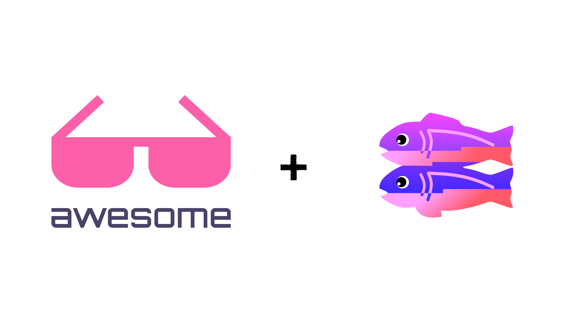

### This awesome list is under construction! ⚠️



# Awesome Glitch

Based on [Glitch's Wall of Fame (Glitch in the wild)](https://support.glitch.com/t/glitchs-wall-of-fame-glitch-in-the-wild/29536) and [Awesome](https://awesome.re/).

> This is a curated list of awesome and useful Glitch projects!

[](https://awesome.re)

## Contribute

Contributions are welcome! Please read the [contribution guidelines](contributing.md) first!

<details>
  <summary>Rules</summary>
  
- Please only add projects, not edit the text (unless you get permission)

- They must follow the Glitch ToS (meaning no pinging, proxies, etc.)
</details>

<details>
  <summary>Example of a submission</summary>
```
|[Title](Link) | Description | [GitHub](https://github.com/user/repo), [Glitch](https://glitch.com/edit/#!/project_name) |
```
</details>

---

| Name | Description | Source Code |
|------|-------------|-------------|
| [Texa](https://deno.land/x/texa) | A Deno web-framework inspired by [Oak](https://deno.land/x/oak) and [Express](https://npmjs.com/package/express), with built-in support for WebSockets, middleware and routing. | [GitHub](https://github.com/ihack2712/texa), [deno.land](https://deno.land/x/texa) |
| [pastedown](https://pastedown.glitch.me) | pastedown is a markdown pastebin written in PHP designed to replace other pastebins. | [GitHub](https://github.com/aboutDavid/pastedown) |
|[GlitchyPastePen](https://glitchypastepen.glitch.me/)| Create simple front-end projects, mainly with HTML, CSS and JS using an online code editor and instantly host it. | [GitHub](https://github.com/khalby786/GlitchyPastePen), [Glitch](https://glitch.com/edit/#!/glitchypastepen) |
| [Learn Code](https://learn-code.me) |  	Make projects on a beautiful site with an online code editor with guides and SVG icons (icons WIP). | [GitHub](https://github.com/code-alt/learn-code), [Glitch](https://glitch.com/edit/#!/learn-code-files) |
| [MarkMe!](https://markme.glitch.me) | A simple, lightweight and beautiful Markdown editor and viewer. | [GitHub](https://github.com/khalby786/markme), [Glitch](https://glitch.com/edit/#!/markme) |


